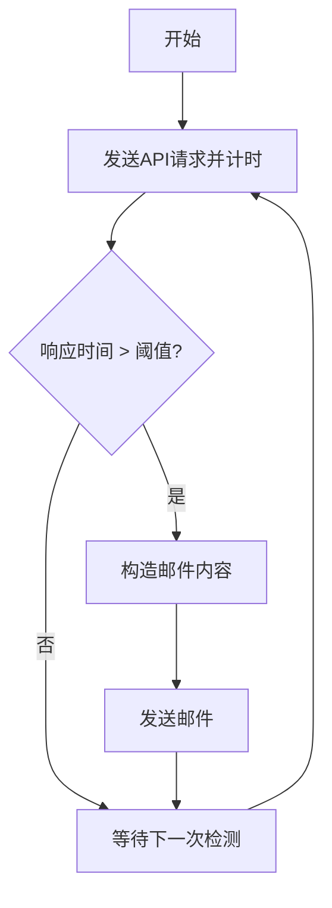

<table align="center">
    <tr>
        <td>module：模块</td>
        <td>variable：变量</td>
    </tr>
    <tr>
        <td>method：方法</td>
        <td>parameter：参数</td>
    </tr>
    <tr>
        <td>function：函数</td>
        <td>property：属性</td>
    </tr>
    <tr>
        <td>type：类型</td>
        <td>class：类</td>
    </tr>
    <tr>
        <td>directory：目录(文件夹)</td>
        <td>constant：常量</td>
    </tr>
    <tr>
        <td>row：行</td>
        <td>column：列</td>
    </tr>
</table>

## Mermaid 语法使用范例

### 思维导图:

### 流程图:

