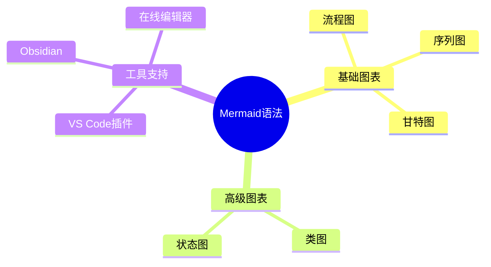
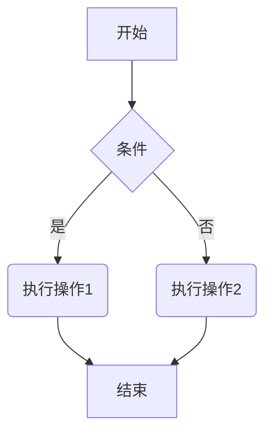
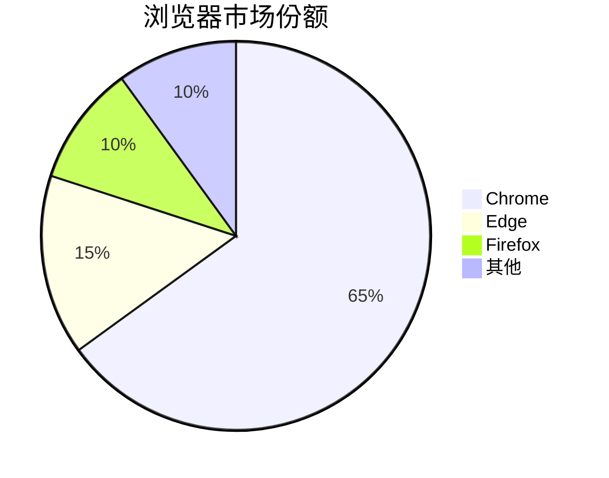
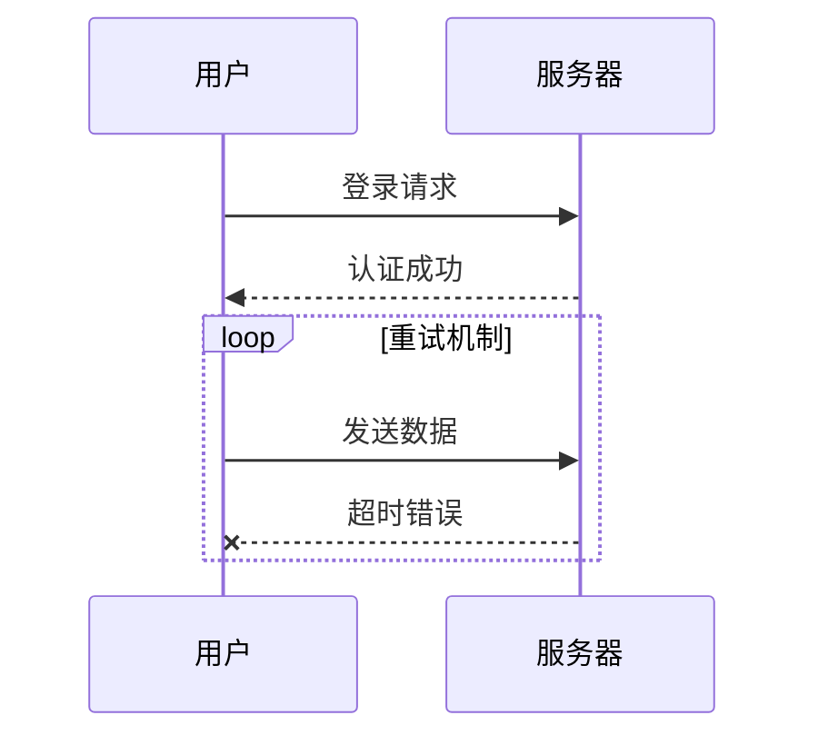
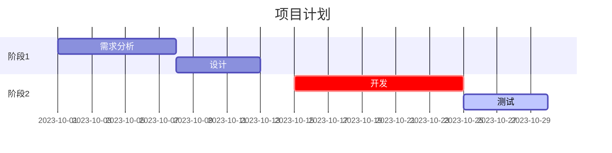
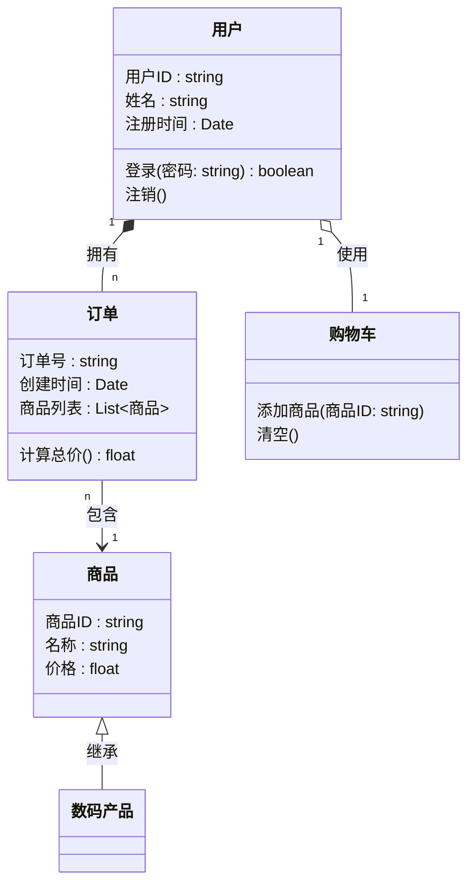
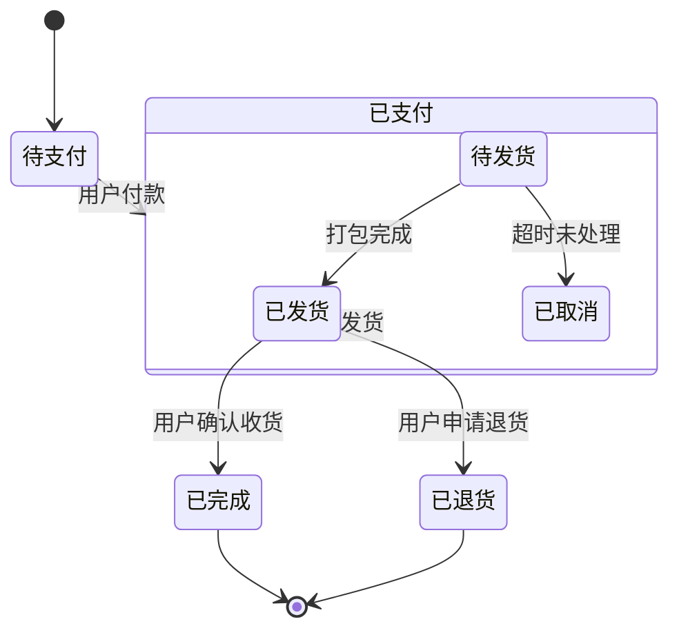
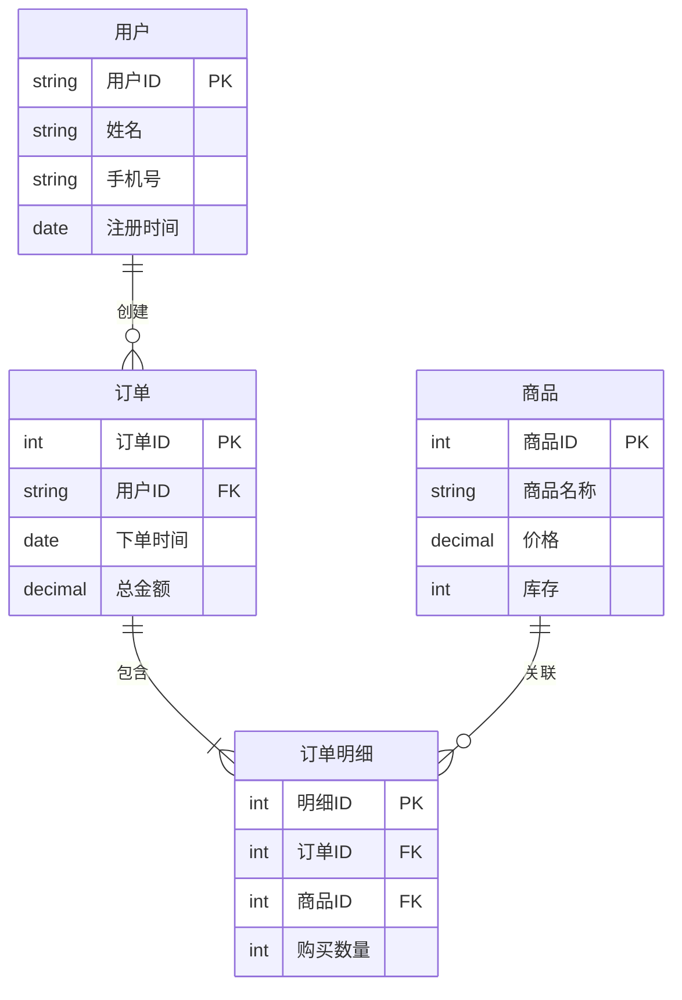

# Mermaid语法
Mermaid 是一个基于 JavaScript 的图表生成工具，它使用简单的文本语法来创建各种图表（如流程图、序列图、甘特图等）。以下是 Mermaid 主要图表类型的详细语法说明：

---

## 1.思维导图(mermaid)

``````
```mermaid
mindmap
  root (())
    
```
``````


- **`root`**：中心主题（默认用 `(())` 表示圆形，可省略）。
- **层级关系**：通过缩进（2/4空格或制表符）表示父子节点。

---

## 2. 流程图（Flowchart）
**用途**：表示过程或系统的工作流程。

``````
```mermaid
graph TD
    A[] --> B{}
```
``````


- **方向**：
  - `TD` / `TB`：从上到下（Top-Down）
  - `BT`：从下到上
  - `LR`：从左到右
  - `RL`：从右到左
- **节点类型**：
  - `A[文本]`：矩形节点
  - `B{文本}`：菱形（条件）
  - `C(文本)`：圆角矩形
  - `D((文本))`：圆形
- **连接线**：
  - `-->`：实线箭头
  - `---`：实线无箭头
  - `-.->`：虚线箭头
  - `==>`：粗线箭头
  - `-- 文本 -->`或`-->|文本|`：带文本的箭头

---

## 3. 饼图（Pie Chart）
**用途**：比例分布。

``````

``````


- 直接写标签和数值即可。

---

## 4. 序列图（Sequence Diagram）
**用途**：展示对象之间的交互顺序。

- **参与者**：`participant 别名 as 显示名称`（可选）。
- **箭头类型**：
  - `->>`：实线箭头
  - `-->>`：虚线箭头
  - `-x`：带X的箭头（表示失败）
  - `->o`：空心箭头（如异步消息）
- **控制结构**：
  - `loop 文本` ... `end`：循环
  - `alt 条件` ... `else` ... `end`：条件分支
  - `opt 可选` ... `end`：可选步骤

---

## 5. 甘特图（Gantt Chart）
**用途**：项目管理中的时间安排。

- **关键语法**：
  - `dateFormat`：定义日期格式。
  - `section`：分组任务。
  - `任务名 :id, start, duration`：
    - `crit`：关键路径
    - `active`：高亮显示
  - 依赖关系：
    - `after 任务ID`：在某个任务后开始。

---

## 6. 类图（Class Diagram）
**用途**：面向对象编程中的类结构。

- **类定义**：
  - `+`：public，`-`：private，``：protected
  - `method()`：方法
- **关系**：
  - `<|--`：继承
  - `*--`：组合
  - `o--`：聚合
  - `-->`：关联

---

## 7. 状态图（State Diagram）
**用途**：描述对象的状态变化。

- **特殊状态**：
  - `*`：初始/终止状态
- **转换**：`状态 --> 状态 : 事件/条件`

---

## 8. 实体关系图（ER Diagram）

- `||--o{`：一对多关系
- 实体属性用 `{}` 包裹。

