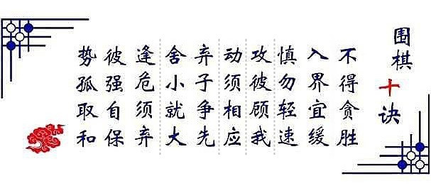

# 局势

“**势能**”是一种能量的存在方式，“势能”的本质是能量储存。“势能”在一定条件下能转化成其他形式的能，这个转化过程就是能量释放过程。放在军事上，就是决战的过程。决战的胜负，取决于双面势能的强弱。

**局势**的变化，就是双方势能的变化，也就是双方优势、劣势的变化。

开局双方各自走棋，经过数个回合的较量，局势就会发生变化，或一方占据优势，或双方势均力敌。要取胜，就要少犯错误，我方要积累优势，减少劣势，对敌方要努力削弱敌方的优势，扩大敌方的劣势，每一步棋都至关重要，即使开局对你不利，小的胜利积累多了，局势就会慢慢的反转（战略防御→战略相持→战略进攻），也就有了取胜的可能。相反，如果决策失误太多，即使开局对你非常有利，占尽天时地利人和，也有可能将胜利葬送。孙子曰:“不可胜在己，可胜在敌。”处于相对劣势或势均力敌的一方要想取胜，不仅需要我方正确决策，还要主动引导或等待对手犯错，如果对手占尽优势，又不犯错误，每一步棋都恰到好处，不可能有赢的机会。

---
# 围棋中的人生哲学

围棋，不仅仅是一种策略性棋类游戏，更被誉为 **“智慧的结晶”与“人生的缩影”**。  
它看似只是黑白双方在棋盘上交替落子，争夺地盘，但其背后蕴含着深刻的**人生哲学、处世智慧与思维方式**。

古人云：“棋如人生，人生如棋。”  
下围棋的过程，就像我们面对人生中的种种选择、挑战、得失与进退。

下面，我们就从多个角度，来探讨**围棋中蕴含的人生哲学**👇：

---

## 一、**黑白之间：对立与统一的辩证思维**

围棋只有**黑与白**两种棋子，却能演化出无穷无尽的变化。

- 黑与白，象征着**对立与矛盾**：竞争、对抗、阴阳、刚柔。
- 但它们又共存于同一棋盘之上，相互依存，缺一不可。

🔍 **人生启示：**
> 人生也充满了对立与矛盾 —— 善与恶、得与失、进与退、快与慢、理想与现实……  
> 但正是这些对立面共同构成了完整的人生。学会在对立中寻找平衡，在矛盾中寻求统一，是人生的大智慧。

---

## 二、**落子无悔：选择与责任**

围棋有一个铁律：**“落子无悔”**。  
一旦落子，就不能反悔，必须为自己的选择承担后果。

- 有时候，一步看似无关紧要的棋，可能会影响全局几十步之后的局势；
- 有时候，为了长远的利益，必须放弃眼前的小利。

🔍 **人生启示：**
> 我们的人生也是由无数个“选择”构成的，每一个决定都可能影响未来的走向。  
> **做决定前深思熟虑，决定后勇敢承担**，不抱怨、不后悔，是成熟人格的体现。  
> 围棋教会我们：**选择之前谨慎，选择之后坚定。**

---

## 三、**大局观：局部与整体的平衡**

围棋中，每一手棋既关乎**局部战斗**，也关乎**全局形势**。

- 有时候，为了整体利益，必须牺牲局部棋子（比如“弃子争先”、“弃子取势”）；
- 有时候，看似占了便宜的局部战斗，却导致全局落后。

🔍 **人生启示：**
> 人生路上，我们常常面临**局部与整体、眼前与长远**的权衡。  
> 围棋告诉我们：不要只盯着眼前的小利，而要有**全局意识与长远眼光**。  
> 学会站在更高的维度思考问题，才能做出更明智的决策。

---

## 四、**先手与后手：主动与被动**

围棋中，“**先手**”意味着主动，“**后手**”常常意味着应对与被动。

- 谁掌握了先手节奏，谁就能控制局面、引导走势；
- 但如果滥用先手，也可能导致资源浪费，反而让对手抓住机会。

🔍 **人生启示：**
> 人生中，**主动出击还是被动应对**，往往决定了我们的处境。  
> 有能力创造机会、把握节奏的人，常常走得更远。  
> 但也要明白，不是任何时候都必须争先，有时候“以静制动”、“后发制人”也是一种智慧。

---

## 五、**厚势与薄棋：积累与冒进**

- **厚势**：指棋形扎实、势力范围广阔、潜力深厚，看似缓慢，但后劲十足；
- **薄棋**：指过分追求效率、过分扩张，导致棋形薄弱，容易被攻击。

🔍 **人生启示：**
> 围棋告诉我们：**稳扎稳打、厚积薄发，往往比急功近利更可靠**。  
> 人生的成功很少是一蹴而就的，而是靠一点一滴的积累。  
> 过于追求短期效果、贪图捷径，可能会留下隐患。  
> **“先做强自己，再图发展”，是一种更深沉的力量。**

---

## 六、**死活之间：取舍与判断**

围棋中有“**活棋**”与“**死棋**”的概念：一块棋如果无法做成两个眼，就会面临被吃掉的命运。

- 棋手必须学会判断哪些子该救，哪些子该弃；
- 有时候，为了救一块棋，可能损失更大；而放弃某些局部，反而能赢得全局。

🔍 **人生启示：**
> 我们的人生中，也常常面临“**什么该坚持，什么该放手**”的抉择。  
> 围棋教会我们：**不是所有的努力都有回报，不是所有的坚持都值得。**  
> 学会判断轻重缓急，懂得取舍之道，是智慧的体现。

---

## 七、**胜负之外：修炼与过程**

虽然围棋以胜负为结果，但真正的高手往往更看重**过程、心态与修炼**。

- 赢一盘棋固然喜悦，但输一盘棋也可能带来更大的成长；
- 顶尖棋手之间的差距，往往不在招法，而在**心理素质、境界与耐心**。

🔍 **人生启示：**
> 人生也不只是为了“赢”，更重要的是**在过程中成长、修炼内心、提升自我**。  
> 输得起，才能赢得久；看得远，才能走得稳。  
> 围棋告诉我们：**胜负只是一时，修行是一生。**

---

## 八、**平衡之道：攻守、进退、刚柔并济**

围棋中，一味进攻可能导致后方空虚，一味防守则可能错失良机。

- 最好的棋局，往往是**攻守兼备、进退有度**；
- 棋手需要根据局势，灵活切换策略，有时主动出击，有时稳守反击。

🔍 **人生启示：**
> 人生路上，我们也要学会**张弛有度、刚柔并济**。  
> 太激进容易翻车，太保守可能错失机会。  
> 学会在不同局面下调整策略，是智慧与成熟的表现。

---

## ✅ 总结：围棋中的十大人生智慧

| 围棋哲理 | 人生启示 |
|----------|-----------|
| **黑白对弈** | 对立统一，阴阳平衡 |
| **落子无悔** | 勇于选择，承担后果 |
| **全局思维** | 眼光长远，不拘小节 |
| **先手后手** | 把握节奏，张弛有度 |
| **厚势薄棋** | 积累为王，不贪捷径 |
| **死活判断** | 懂得取舍，学会放手 |
| **胜负之外** | 重在过程，修炼内心 |
| **攻守平衡** | 刚柔并济，灵活应对 |
| **势地之争** | 知进退，明得失 |
| **一盘大棋** | 人生如局，落子无悔 |

---

## 🎯 最后，用一句经典围棋谚语作结：

> **“棋如人生，人生如棋；善弈者谋势，不善弈者谋子。”**

真正会下围棋的人，看的不是眼前一子得失，而是**全局之势、长远之局**；  
真正懂人生的人，也不会纠结于一时成败，而是着眼于**整体格局与内心成长**。

---

# 围棋十诀

“**围棋十诀**”是中国围棋智慧的结晶，被誉为**围棋战略与人生哲理相结合的经典指南**，已经有上千年历史。

它最早可以追溯到**唐代围棋国手王积薪**，后来经过历代棋手的总结与提炼，最广为流传的版本是由**宋代围棋大师刘仲甫**所整理，并由**明代棋手过百龄**等人推广。也有说法认为其最早源于**唐代王积薪口诀**，后由**宋代或明代完善定型**。

这“十诀”虽然只有短短40个字，但每一句都浓缩了围棋中的**战略思想、战术原则与人生智慧**，至今仍被职业棋手、业余爱好者奉为圭臬。

---

## 🎯 围棋十诀原文（传统版本）

> **一、不得贪胜**  
> **二、入界宜缓**  
> **三、攻彼顾我**  
> **四、弃子争先**  
> **五、舍小就大**  
> **六、逢危须弃**  
> **七、慎勿轻速**  
> **八、动须相应**  
> **九、彼强自保**  
> **十、势孤取和**

下面我们逐条讲解其**原意、围棋中的应用，以及背后的人生哲理** 👇

---

## 一、不得贪胜

🔹 **原意：** 不要一味贪图胜利，尤其是在优势时过于急躁，反而容易翻车。

🔹 **围棋含义：**
- 当你占据较大优势时，要沉得住气，稳健收束，不冒险、不冒进；
- 贪功冒进可能导致优势丧失，甚至逆转。

🔹 **人生哲理：**
> **“过犹不及”**，人生中追求成功是好事，但过分贪求胜利，反而容易因小失大。  
> **稳重、克制、不骄不躁，是真正成熟的表现。**

🔹 **点评：** 不是不能进，而是不能冒进，否则容易陷入敌方的圈套，葬送好不容易争取来的优势。但是在保证我方安全的前提下，就要穷追猛打，趁其病要其命，不给敌人喘息机会。

---

## 二、入界宜缓

🔹 **原意：** 进入对方势力范围时，不要急着进攻，应该循序渐进。

🔹 **围棋含义：**
- 当你进入对方的地盘（比如对方的角、边）时，不要贸然打入或深入，应该先观察、试探，逐步蚕食；
- 急于进攻容易被对方反击或包围。

🔹 **人生哲理：**
> 进入陌生领域、挑战别人优势时，**不要冒进，要小心试探、稳扎稳打**。  
> 深入敌后之前，先想好退路与策略。

---

## 三、攻彼顾我

🔹 **原意：** 在攻击对方时，也要注意保护自己，不能只顾进攻而忽略自身弱点。

🔹 **围棋含义：**
- 攻击对方棋子或地盘时，要时刻关注自己的薄弱环节，防止被对手反击；
- 攻守要兼顾，不能顾此失彼。

🔹 **人生哲理：**
> 在追求目标、挑战他人时，也要时刻**保持自我保护意识，注意自身安全与发展**。  
> **“进攻是最好的防守”没错，但前提是你站得稳。**

---

## 四、弃子争先

🔹 **原意：** 有时候主动放弃一些棋子，是为了争取主动权、先手优势。

🔹 **围棋含义：**
- 棋局中，有些棋子注定难以保全，与其纠缠，不如**果断弃掉，换取更重要的先手或全局主动**；
- 弃子不是失败，而是为了更高层次的战略。

🔹 **人生哲理：**
> 人生中，有时候**懂得放手、放弃局部利益，才能获得更大的发展机会**。  
> 学会“断舍离”，是一种智慧。

---

## 五、舍小就大

🔹 **原意：** 放弃小的利益，追求更大的局面或地盘。

🔹 **围棋含义：**
- 在局部战斗中，不要纠结于小范围的得失，而要看**整体谁围的地更多、潜力更大**；
- 眼光要放长远，格局要大。

🔹 **人生哲理：**
> 不要只看眼前的小利，而要**看到更长远的收益与更大的目标**。  
> **有舍才有得，格局决定结局。**

---

## 六、逢危须弃

🔹 **原意：** 当局面陷入危险时，要果断舍弃部分棋子，避免更大损失。

🔹 **围棋含义：**
- 当一块棋面临被吃、无法做活时，如果继续纠缠只会损失更多，就要果断放弃，保全大局；
- 有经验的棋手知道什么时候该“壮士断腕”。

🔹 **人生哲理：**
> 面对已经无法挽回的损失或危险的局势，**及时止损是一种智慧**。  
> 不要因为情感或面子，而继续投入已经注定失败的方向。

---

## 七、慎勿轻速

🔹 **逐字拆解**
- **慎**：小心、谨慎（比如“慎重”“谨言慎行”）。  
- **勿**：不要（文言里常见的否定词，比如“勿动”“请勿吸烟”）。  
- **轻**：轻率、随便（比如“轻信”“轻举妄动”）。  
- **速**：快速、匆忙（比如“速度”“速战速决”）。  

   **连起来直译**：**“小心啊，不要轻率又匆忙！”**（就像长辈叮嘱你：“做事别毛毛躁躁的！”）

🔹 **原意：** 不要草率落子、急于求成，每一步都要谨慎思考。

🔹 **围棋含义：**
- 围棋每一手都影响全局，尤其是开局和中盘阶段，草率行棋容易留下后患；
- 轻率出手，往往导致被动甚至失败。

🔹 **人生哲理：**
> 做决策时，**不要急躁冲动，三思而后行**。  
> 慎重不是犹豫，而是对选择负责任的态度。

---

## 八、动须相应

🔹 **原意：** 行动要有章法，落子要与全局战略相呼应，不能孤立无援。

🔹 **围棋含义：**
- 每一步棋都不是孤立的，要和周围的棋子形成配合，互为支援；
- 孤军深入、没有后续手段的着法，容易被对手攻击。

🔹 **人生哲理：**
> 做事要有**全局观与连贯性**，不能只看一步。  
> 你的行动，应该与你的目标、计划和资源相匹配。

---

## 九、彼强自保

🔹 **原意：** 当对手势力强大时，不要硬碰硬，而应先确保自身安全。

🔹 **围棋含义：**
- 对方地盘稳固、势力庞大时，不要贸然打入，而是先巩固自己，寻找对方弱点再图反击；
- 强敌面前，生存第一。

🔹 **人生哲理：**
> 面对强大的对手或困难时，**先保护好自己，再寻找机会**。  
> 不是所有的战斗都要正面硬刚，有时候“避其锋芒”才是大智慧。

---

## 十、势孤取和

🔹 **原意：** 当自己的棋子处于孤立无援的弱势时，不要强行作战，而应争取平和收束。

🔹 **围棋含义：**
- 当一块棋势单力薄、难以争胜时，不如**主动求和、平稳过渡，避免被吃**；
- 有时候“和棋思维”（即平稳处理）比硬拼更明智。

🔹 **人生哲理：**
> 当你处于劣势或孤立无援时，**不要逞强，懂得妥协与平和也是一种智慧**。  
> 保全实力，等待转机，比盲目对抗更有效。

---

## ✅ 总结：围棋十诀一览表（精简版）

| 诀 | 核心思想 | 人生启示 |
|----|----------|-----------|
| 一、不得贪胜 | 不骄不躁，稳重取胜 | 胜不骄，懂得克制 |
| 二、入界宜缓 | 进入陌生领域要谨慎 | 深入之前先试探 |
| 三、攻彼顾我 | 攻击别人也要保护自己 | 自保与进攻兼顾 |
| 四、弃子争先 | 放弃局部，争取主动 | 有舍才有得 |
| 五、舍小就大 | 看大局，不纠结小利 | 格局决定结局 |
| 六、逢危须弃 | 危险时果断止损 | 及时放弃，避免更大损失 |
| 七、慎勿轻速 | 谨慎思考，不草率行事 | 三思而后行 |
| 八、动须相应 | 行动要有配合与章法 | 全局观与连贯性 |
| 九、彼强自保 | 面对强敌先自保 | 不硬碰硬，先求生存 |
| 十、势孤取和 | 弱势时争取平和 | 懂得妥协与等待 |

---

## 🧠 延伸思考：

围棋十诀不仅仅是下棋的战术原则，它更是一种**关于决策、取舍、进退、攻守、平衡的人生哲学**。

它教我们在面对复杂局势时，如何**权衡利弊、控制情绪、保持理智、追求长远**。

这也是为什么很多企业家、政治家、军事家都喜欢研究围棋——因为它不仅是游戏，更是关于**战略思维与人生修炼的隐喻**。

---

# 围棋十诀在决策中的应用

围棋十诀不只是下棋时的战术口诀，它更是一套浓缩了**战略思维、决策智慧与人生哲学**的宝贵经验。这些思想完全可以迁移到我们**日常生活、职场发展、商业决策、投资判断乃至人际关系处理**等方方面面。

下面，我将结合 **围棋十诀的每一条**，具体说明它如何指导我们在**现实决策中更加明智、理性与高效**👇：

---

## 🎯 一、不得贪胜 → **决策时：避免因贪婪而翻车**

### 围棋含义：
优势时过于急躁，想一举拿下胜利，反而因冒进而失去好局。

### 决策应用：
- 当你在某个领域已经领先、事情进展顺利时，**不要急于求成，盲目扩大战果**；
- **稳扎稳打，控制节奏，确保成果落袋为安**，比一味冲刺更重要。

✅ **现实例子：**
> - 投资中已有盈利，却因贪心不卖出，最后反而亏损；
> - 职场中项目已成功在望，却想“再加一把火”，结果失误导致前功尽弃。

🔑 **决策智慧：**
> **领先时不冒进，成功时不忘形，稳住才能赢到底。**

🔑 **点评：** 并非绝对不能更进一步，而是要保证安全，不能盲目前进，避免因错误决策而葬送优势。

---

## 🎯 二、入界宜缓 → **进入新领域：先观察，后行动**

### 围棋含义：
进入对方地盘时，不要贸然深入，要循序渐进，避免被围攻。

### 决策应用：
- 当你准备进入一个**新市场、新行业、新团队或陌生环境**时，不要急着“大干一场”；
- 先花时间**了解规则、观察局势、试探反应**，再逐步深入。

✅ **现实例子：**
> - 职场跳槽进入新公司，别一上来就提大改革，先融入再影响；
> - 创业者进入新市场，先小范围试水，而不是全面铺开。

🔑 **决策智慧：**
> **“先退后进”，谋定而后动，在陌生领域中谨慎试探比冒进更安全。**

---

## 🎯 三、攻彼顾我 → **追求目标时：别忘了保护自己**

### 围棋含义：
攻击对方时，也要时刻注意自己的弱点，不能只顾进攻忽略防守。

### 决策应用：
- 在追求某个目标（如竞争、项目推进、业绩增长）时，**也要关注自身短板与潜在风险**；
- 不要只盯着对手或目标，而忽视了**自我保护与可持续性**。

✅ **现实例子：**
> - 企业打价格战抢市场，却忽视了自身资金链风险；
> - 个人全力冲刺事业，却忽略了健康与家庭。

🔑 **决策智慧：**
> **进攻是最好的防守，但前提是你站得稳。攻守兼顾才是长久之道。**

---

## 🎯 四、弃子争先 → **决策取舍：有舍才有得**

### 围棋含义：
主动放弃一些棋子，以换取先手主动权或更大局面。

### 决策应用：
- 在做决策时，**有些东西看似重要，实则可以放弃，以换取更关键的资源、时间或机会**；
- 学会放弃局部，才能赢得全局。

✅ **现实例子：**
> - 放弃一个稳定但没前景的工作，去追求更有成长性的机会；
> - 砍掉不赚钱的业务线，集中资源做核心业务。

🔑 **决策智慧：**
> **有时候，放弃是为了更好的获得。学会权衡轻重，敢于断舍离。**

---

## 🎯 五、舍小就大 → **战略思维：看全局，不纠结小利**

### 围棋含义：
不要纠结于局部的得失，而要看哪片区域的潜力更大、整体收益更高。

### 决策应用：
- 做决策时，把眼光放长远，关注**整体价值与未来回报，而不是眼前的蝇头小利**；
- 不因小失大，懂得从更高维度判断什么是“大”、什么是“小”。

✅ **现实例子：**
> - 投资时，不要因为短期波动频繁买卖，而错失长期增长的红利；
> - 企业不要只看季度营收，而忽略长期品牌与技术投入。

🔑 **决策智慧：**
> **格局决定结局，要有“看见森林”的能力，而非纠结于几棵树。**

---

## 🎯 六、逢危须弃 → **危机决策：及时止损是一种智慧**

### 围棋含义：
当一块棋已经无法挽救，继续纠缠只会损失更大，就要果断放弃。

### 决策应用：
- 当你发现某个项目、投资、合作已经明显走向失败，**不要因为沉没成本而硬撑**；
- 学会**及时止损，把资源转移到更有希望的方向**。

✅ **现实例子：**
> - 股票大跌且基本面恶化，及时割肉比死扛更明智；
> - 某个业务持续亏损，尽早砍掉才能保住公司整体健康。

🔑 **决策智慧：**
> **面对无可挽回的损失，敢于放手，是成熟决策者的标志。**

---

## 🎯 七、慎勿轻速 → **快速决策：三思而后行**

### 围棋含义：
每一手棋都影响全局，草率出手容易留下致命弱点。

### 决策应用：
- 面对重要决策时，**不要急躁、不要冲动，给自己留出思考与分析的时间**；
- 快速行动很重要，但**盲目的快，不如深思熟虑的慢**。

✅ **现实例子：**
> - 签署重大合同、投资协议前，不要因为“怕错过”而草率签字；
> - 职场中回复重要邮件、做决策前，先理清思路，避免后悔。

🔑 **决策智慧：**
> **慎重的“慢”，是为了更有效的“快”。**

---

## 🎯 八、动须相应 → **行动一致：决策要有系统性与配合**

### 围棋含义：
每一步棋都要与全局战略相呼应，不能孤立无援。

### 决策应用：
- 做决策时，要考虑**这一步与你的整体目标、资源、计划是否一致**；
- 单点行动容易失败，**系统性的、连贯性的决策更容易成功**。

✅ **现实例子：**
> - 企业推出新产品，要有配套的市场、渠道、服务策略，不能只靠一个点子；
> - 个人职业发展，学习新技能也要配合职业路径，而不是盲目跟风。

🔑 **决策智慧：**
> **行动要成体系，孤立的决策往往难以奏效。**

---

## 🎯 九、彼强自保 → **面对强敌：先保护自己，再找机会**

### 围棋含义：
对手过于强大时，不要硬碰硬，先确保自身安全，再寻找反击机会。

### 决策应用：
- 当你面对**强大的竞争对手、权威的领导、困难的局面**时，不要贸然对抗；
- 先**稳固自身、积累实力，等待时机再出手**。

✅ **现实例子：**
> - 职场中遇到强势领导，先适应环境，再找合适方式表达观点；
> - 创业公司面对行业巨头，不要正面硬刚，而是寻找差异化突破口。

🔑 **决策智慧：**
> **生存下来，是反击的前提。强敌面前，先保护好自己。**

---

## 🎯 十、势孤取和 → **处于劣势：以和为贵，稳健过渡**

### 围棋含义：
当自己势单力薄、难以争胜时，不如争取平稳收束，避免更大损失。

### 决策应用：
- 当你处于**资源不足、支持有限、竞争激烈**的劣势局面时，不要强行对抗；
- **以稳为主，争取时间、空间与转机**，比硬拼更明智。

✅ **现实例子：**
> - 某项业务在市场中处于劣势，先维持基本运营，再图转型；
> - 个人在职场竞争中暂时落后，不如先积累实力，而非焦虑冒进。

🔑 **决策智慧：**
> **有时候，求和不是认输，而是为了更好地赢在未来。**

---

## ✅ 总结：如何用“围棋十诀”指导现实决策？

| 围棋十诀 | 决策原则 | 核心思想 |
|----------|-----------|-----------|
| 不得贪胜 | 稳住优势，不骄不躁 | 成功时更需克制 |
| 入界宜缓 | 进入新领域要谨慎 | 先观察，后行动 |
| 攻彼顾我 | 追求目标也要自保 | 攻守平衡 |
| 弃子争先 | 有舍才有得 | 敢于放弃局部 |
| 舍小就大 | 看全局，不纠结小利 | 格局导向 |
| 逢危须弃 | 及时止损 | 懂得断舍离 |
| 慎勿轻速 | 决策要谨慎 | 三思而后行 |
| 动须相应 | 行动要有配合 | 系统性思维 |
| 彼强自保 | 面对强敌先自保 | 生存第一 |
| 势孤取和 | 劣势时以和为贵 | 稳健过渡 |

---

## 🧠 延伸一句话总结：

> **围棋十诀的核心，是教我们在复杂局面中保持清醒、权衡利弊、控制情绪、追求长远。它不仅是棋道，更是人生与决策的大智慧。**

---

